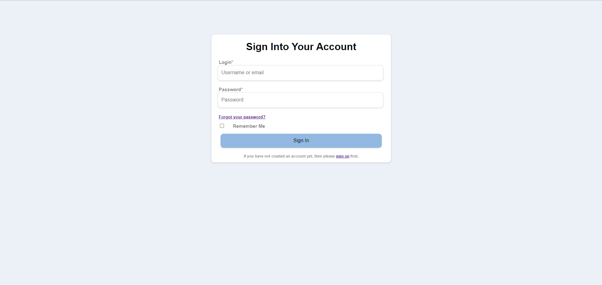
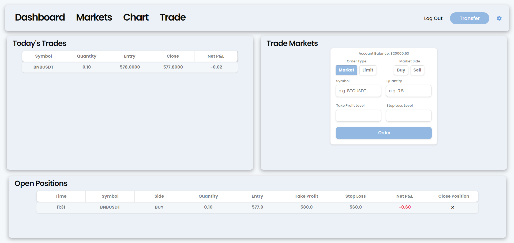

# Horizon Markets

## Purpose of the Project

**Description:**

Welcome to Horizon Markets! Horizon Markets is a web-based cryptocurrency exchange designed to empower users with comprehensive tools for trading and analysis. With support for over 152 cryptocurrencies, users can seamlessly navigate through the platform to explore, chart, analyze, and execute trades with ease. Our priority lies in providing a secure environment for transactions, ensuring the safety and convenience of deposits and withdrawals through over 5 supported payment methods.

**Favourite Coins:** 

Horizon Markets introduces the feature to favorite specific cryptocurrencies, enhancing the user experience by enabling direct access to price information for these chosen coins from their dashboard. This functionality equips users with up-to-date insights, empowering them to make informed decisions and improve their trading performance.

**Advanced Charting:** 

Our platform offers advanced charting capabilities, allowing users to stack up to three advanced TradingView widget charts on the charts page. This facilitates in-depth analysis as users can compare different time frames or cryptocurrencies simultaneously. This feature is instrumental in providing users with comprehensive insights into market trends, aiding them in making strategic trading decisions.

**Execute Trades:** 

Horizon Markets is equipped with advanced trading features tailored to accommodate various trading styles and preferences. Users can utilize functionalities such as limit and market orders, stop-loss and take-profit integration, and a quick-close button to efficiently manage their positions. These features empower users to execute trades with precision and agility, enhancing their overall trading experience on our platform.

### Why This Project:

At Horizon Markets, our project aims to revolutionize cryptocurrency trading by providing a user-centric platform equipped with cutting-edge features and functionalities. We empower traders of all levels with comprehensive tools, allowing them to view, chart, and analyze over 152 supported cryptocurrencies while executing trades seamlessly. Our platform enhances user experience by streamlining the trading process, offering advanced charting capabilities for in-depth analysis, and prioritizing security and convenience with secure transaction processes and multiple payment methods. With tailored trading features such as limit and market orders, stop-loss and take-profit integration, and a quick-close button, Horizon Markets caters to diverse trading styles and preferences. Join us and experience the future of cryptocurrency trading today!

### Project Objectives:

- *Secure and Seamless Registration:* Incorporate Django's built-in OAuth system to enable users to register and log in securely with seamless integration. Enable users to modify their account credentials to rectify any inaccuracies or mistakes in their information.

- *Secure Transaction Processes:* Integrate the APIs of Stripe and PayPal to facilitate various payment and withdrawal options, ensuring flexibility for users.

- *Comprehensive Charting:* Develop a system that enables users to access and manage up to three charts simultaneously, each equipped with diverse charting features to enhance cryptocurrency analysis capabilities.

- *Advanced Trading:* Implement an intuitive and responsive trading interface that empowers users to execute trades efficiently and effectively, incorporating advanced order types, real-time market data, and customizable trading strategies to optimize their trading experience.

- *Customer-Support System:* Establish a customer support system that provides assistance to user inquiries and issues, utilizing Django's built in mail protocall.

## User Stories

### Current User Stories:

1. **As a new user**, As a cryptocurrency trader, I want to be able to easily register for an account on Horizon Markets through OAuth integration, so that I can quickly access the platform. 

2. **As a seasoned investor**, I want the ability to customize my dashboard on Horizon Markets by favoriting specific cryptocurrencies, so that I can easily track their prices and performance without having to search through a long list of coins.

3. **As a technical analyst**, I want access to advanced charting features on Horizon Markets, such as the ability to stack up to three different charts with various timeframes and indicators, so that I can conduct in-depth analysis and make well-informed trading decisions.

4. **As a security-conscious user**, I want Horizon Markets to offer multiple payment and withdrawal methods, including integration with reputable payment processors like Stripe and PayPal, so that I can choose the most convenient and secure option for managing my funds on the platform.

5. **As a novice trader**, I want Horizon Markets to provide a user-friendly trading interface with intuitive features like limit and market orders, stop-loss and take-profit options, and a quick-close button, so that I can easily execute trades and manage my positions without feeling overwhelmed by complex trading terminology.

### Future User Stories:

1. **As a high-volume trader**, I want Horizon Markets to introduce a VIP or premium membership program with exclusive benefits such as reduced trading fees, priority customer support, and access to advanced trading tools and analytics, to incentivize loyalty and attract more active traders to the platform.

2. **As a global trader**, I want Horizon Markets to expand its supported languages beyond English to cater to a more diverse user base, ensuring that non-English speaking users can navigate the platform and access support resources in their preferred language.

3. **As a trader interested in diversifying my portfolio**, I want Horizon Markets to introduce support for trading derivatives such as futures contracts and options, so that I can hedge my positions and take advantage of price movements in the cryptocurrency market.

## Features

### Key Features:

- **Registration:** Allows users to become members of the website, disabling any incorrect inputs.

- **Log-In:** Allows users to enter their individual accounts, validating information and displaying error messages if any of the information is incorrect.

- **Navigation:** Easy-to-use navigation for a seamless user experience while navigating the website. This feature displays navigation links, guiding you to each individual section of the website, along with the settings page and log-out button.

- **Dashhboard:** Displays the user's account history information, along with live price updates and details about their favorite cryptocurrency coins.

- **Markets:** Showcases the price action of any cryptocurrency through simple charts, while also offering the ability to favorite cryptocurrencies.

- **Chart:** Users can view and analyze up to a total of three advanced charts simultaneously, across any chosen cryptocurrency and time frame.

- **Trade:** Enables users to trade any cryptocurrency, offering features such as limit and market orders, stop-loss, and take-profit options. Additionally, it displays current positions and relevant information, along with a summary of today's trades.

- **Settings:** Includes a customer support section where users can reach out for technical assistance, as well as the ability to update their current user profile information.

- **Deposits:** Allows users to securely deposit funds into their account using Stripe's payment processes.

- **Withdrawals:** Allows users to securely withdraw funds from their account using PayPal's payment processes.

- **Transactions:** Showcases all trades executed, providing comprehensive information about each trade.

## Future Features

### Planned Future Features:

- Implement additional currency pairs, starting with GBP (British Pound) and EUR (Euro), to provide users with more trading options.
- Implement margin trading functionality, allowing users to borrow funds to leverage their positions and potentially increase their returns (while also increasing their risk).
- Introduce a premium membership program with exclusive benefits such as reduced trading fees.

## User Experience Design Features

### Typography:

- **Primary Font:**  *Poppins*, Poppins is a widely used font known for its modern, clean appearance and high readability. Its balanced proportions and consistent letterforms make it suitable for this web-application. Available in multiple weights and styles, Poppins offers versatility for different typographic needs, supporting both headlines and body text. Additionally, its international support and accessibility features, such as open counters and ample spacing, cater to diverse audiences and ensure readability across languages and user groups. Poppins is also favored for branding purposes due to its contemporary yet neutral aesthetic, helping maintain brand consistency across different platforms and communications. Overall, Poppins is valued for its contemporary design, readability, versatility, and accessibility, making it a personal choice.

- **Secondary Font:** *Sans-Serif*, I chose sans-serif as my secondary font because it is a basic font that is universally supported across all browsers. In the event that my main font fails to load for any reason, I can rely on and depend on sans-serif as a fallback option.

### Color Scheme:

- **Primary Color:**  *#437DBC*, Using the color #437DBC in UI and UX design offers several advantages. Its deep blue hue with a hint of cyan creates a visually appealing palette, drawing users' attention and enhancing engagement. Additionally, the color conveys professionalism and trustworthiness, making it suitable for trading interfaces. Its clear contrast against light backgrounds improves readability and ensures key elements stand out.
  
- **Secondary Color:** *#93B8E1* Using the color #93B8E1 as a secondary color in UI and UX design offers several benefits. Its soft and muted blue tone creates a calming and soothing effect, complementing primary colors and enhancing the overall color palette. As a secondary color, #93B8E1 can be used for accents, highlights, or background elements, providing visual interest without overpowering the primary content. Its gentle hue promotes a sense of harmony and balance in the interface, contributing to a cohesive and pleasant user experience. Additionally, #93B8E1 maintains good contrast against darker or lighter tones, ensuring readability and accessibility.

## Wireframes

### Wireframes:

- **Dashboard Wireframe:** 

- **Markets Wireframe:** 

- **Chart Wireframe:** 

- **Trade Wireframe:** 

## Technologies

### Languages:

- **HTML:** Used to structure the contents for my website.
- **CSS:** Used to style the content of my website.
- **JavaScript:** Used to add the interactivity to the elements.
- **Python:** Used for the back-end and data management.
- **Sqlite:** Used as the database for the website.

**Frameworks and Add-Ons:**

- **Django:** Web Developent framework for Python.
- **Bootstrap:** Used to make the website scalable across multiple screen sizes.
- **Chart.js:** Used to create the graphs on my website.
- **Stripe API:** Used for secure deposits.
- **PayPal API:** Used for secure Withdrawals.
- **Binance Websocket and  API:** Used for trading information and execution of trades.
- **TradingView API:** Used for charting and displaying markets.
- **Google Fonts:** Used to apply non-included fonts onto my text.

**Additional:**

- **GitPod:** My Integrated Development Environment.
- **Git and Github:** Used Git for source code management and github for version control.
- **Heroku:** For deployment of my website.
- **ElephantSQL:** Cloud-based PostgreSQL database service that I used to host my database.

## Testing

### W3C Validator:

- ***HTML*** 

### Jigsaw Validator:
- ***CSS*** 

### JSHint:
- ***JavaScript Dashboard*** 

### JSHint:
- ***JavaScript Asset*** 

### JSHint:
- ***Python*** 

### Manual Testing:

| Feature                      | Action                                | Expected Result                    | Tested | Passed  | Comments   |
| ---------------------------- | ------------------------------------- | ---------------------------------- | ------ | ------- | ---------- |
| Dashboard Navigation         | Click on the 'Dashboard' link         | Redirect to Dashboard page         | ✅     | ✅     | Works Fine |
| Income & Expenses Navigation | Click on the 'Income & Expenses' link | Redirect to Income & Expenses page | ✅     | ✅     | Works Fine |
| Assets Navigation            | Click on the 'Assets' link            | Redirect to Assets page            | ✅     | ✅     | Works Fine |
| Log Out button               | Click on the 'Log Out' Button         | Redirect to Log In page            | ✅     | ✅     | Works Fine |
| View All Transactions Page   | Click on the 'View All' button        | Redirect to All Transactions page  | ✅     | ✅     | Works Fine |
| Form Submits                 | Click on the 'Submit' buttons         | Redirect to relevant pages         | ✅     | ✅     | Works Fine |
| Register Page Form           | Fill register form out and submit     | If fields not empty it redirects   | ✅     | ✅     | Works Fine |
| Log In Page Form             | Fill Log In form out and submit       | If fields not empty it redirects   | ✅     | ✅     | Works Fine |
| Savings Goal Chart           | Add transaction income & earning      | Chart updates based on transaction | ✅     | ✅     | Works Fine |
| Net Worth Goal Chart         | Add an asset or change salary         | Chart updates based on assets      | ✅     | ✅     | Works Fine |
| Asset Chart                  | Dispalys all assets and amounts       | Dispalys all assets and amounts    | ✅     | ✅     | Works Fine |
| Total Asset Value number     | Add an asset or delete an asset       | Number updates based on assets     | ✅     | ✅     | Works Fine | 
| Savings number               | Add transaction income & earning      | Number updates based on transaction| ✅     | ✅     | Works Fine |
| Net Worth number             | Add an asset or change salary         | Number updates based on assets     | ✅     | ✅     | Works Fine |
| Salary Circle                | Click "Edit Salary" and submit salary | Salary Circle updates to new salary| ✅     | ✅     | Works Fine |
| Add Transaction              | Click and fill out the form           | If fields not empty it submits     | ✅     | ✅     | Works Fine |
| Delete Transaction           | Click and fill out the form           | If fields not empty it submits     | ✅     | ✅     | Works Fine |
| Add Asset                    | Click and fill out the form           | If fields not empty it submits     | ✅     | ✅     | Works Fine |
| Delete Asset                 | Click and fill out the form           | If fields not empty it submits     | ✅     | ✅     | Works Fine |

### Fixed Bugs:

1. **Negative Savings and Net Worth Goal:** When registering as a user on the website, you are required to enter a "Savings Goal" and a "Net Worth Goal." I discovered that if users enter a negative number or zero, the charts won't display correctly. To address this issue, I added extra validation during registration in the form of an if-else statement: ***if int(net_worth_goal) <= 0:*** and ***elif int(savings_goal) <= 0:*** . This resolution ensures that users cannot input non-positive values for these goals, preventing potential issues with chart display.

### Supported Screen Sizes:

- **For Small, Medium and Large Phone Screen Sizes:** (Breakpoint: 320px to 576px).
- **For Small and Medium Tablet Sizes:** (576px to 768px).
- **For Small and Medium Laptop Screen Sizes:** (768px to 992px).
- **For Large Laptop and Small Desktop Screen Sizes:** (992px to 1200px).
- **For Large Desktop Screen Sizes:** (1200px +).

### Database Schema:

The FinanceTracker database consists of three interconnected tables: **User**, **Transaction**, and **Asset**. The **User** table serves as the central entity, containing user-specific information such as username, password, financial goals, net worth, savings, and salary. Both the **Transaction** and **Asset** tables are linked to the **User** table through the `user_id` foreign key, establishing a relational connection. In the **Transaction** table, each entry corresponds to a financial transaction made by a user, with details including the transaction date, type, category, and amount. The **Asset** table represents assets owned by users, featuring information such as the asset name and its associated value. The foreign key relationships, particularly with `user_id`, enable a cascading effect, ensuring that when a user is removed, their related transactions and assets are automatically deleted as well. This schema provides a comprehensive framework for managing user information, financial transactions, and owned assets within the FinanceTracker application.

## Deployment

To deploy the site, I first created an instance of my database in ElephantSQL. Then, in my IDE, I created a requirements.txt file listing all libraries, frameworks, and add-ons I have used. Following that, I created a Procfile with the commands needed to run my web app. Finally, on Heroku, I added all my environment variables and deployed my site.

The Site was Deployed on Heroku. This is the link <https://my-finview-15e37362d8a7.herokuapp.com/>